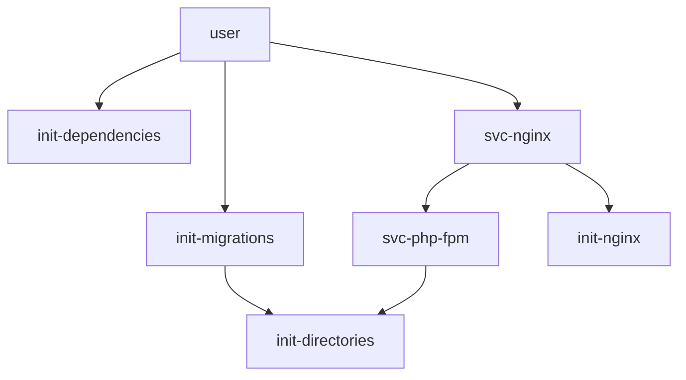

I developed a small cli in golang to ease creating, validating and documenting services that s6 supervises.

- The repo: https://github.com/dazz/s6-cli
- The docker image: https://hub.docker.com/repository/docker/hakindazz/s6-cli

## Usage
You do not need to install anything, just execute the binary via docker

```shell
docker run -it --rm hakindazz/s6-cli help
```

```shell
COMMANDS:
   create, c   create a service
   remove, rm  remove a service
   lint, l     lint directories and files
   mermaid, m  document s6 service dependencies in mermaid syntax
   help, h     Shows a list of commands or help for one command
```


## Create a service with s6-cli

```shell
docker run -it --rm -v ./:/etc/s6-overlay hakindazz/s6-cli create oneshot init-dependencies
```

Here is the file / directory structure it creates:

```shell []
/etc/s6-overlay/s6-rc.d
├── init-dependencies
│   ├── dependencies.d
│   │    ├── base
│   │    └── svc-php-fpm
│   ├── type
│   └── up
└── scripts
        └── init-dependencies
```

- The `base` dependency is added by `s6-cli`
- Adding `base` as default dependency tells s6-rc to only start a service when all the base services are ready, and it prevents race conditions

## Use s6-cli in your CI

```shell
docker run -it --rm -v .:/etc/s6-overlay hakindazz/s6-cli lint
```

It will tell you when it does not find any issue
```shell
s6-cli: lint found no issues
```

Or list the findings so you can fix them before you deploy.

```shell
s6-cli: lint found issues with services in /etc/s6-overlay/s6-rc.d
- svc-lint-me
  - type file for "svc-lint-me" does not end with a newline
  - invalid type in svc-lint-me/type file specified
```


## Document your setup with mermaid

You can use the `mermaid` command to output the dependency graph between the services:

```shell
docker run -it --rm -v .:/etc/s6-overlay hakindazz/s6-cli mermaid
```

```


Which will result in this mermaid


graph TD;
user --> init-dependencies
user --> init-migrations
user --> svc-nginx
init-migrations --> init-directories
svc-php-fpm --> init-directories
svc-nginx --> init-nginx
svc-nginx --> svc-php-fpm


