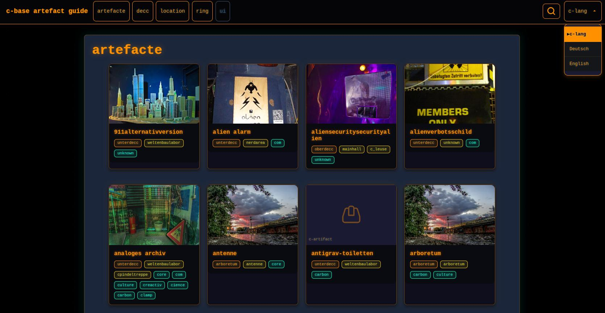
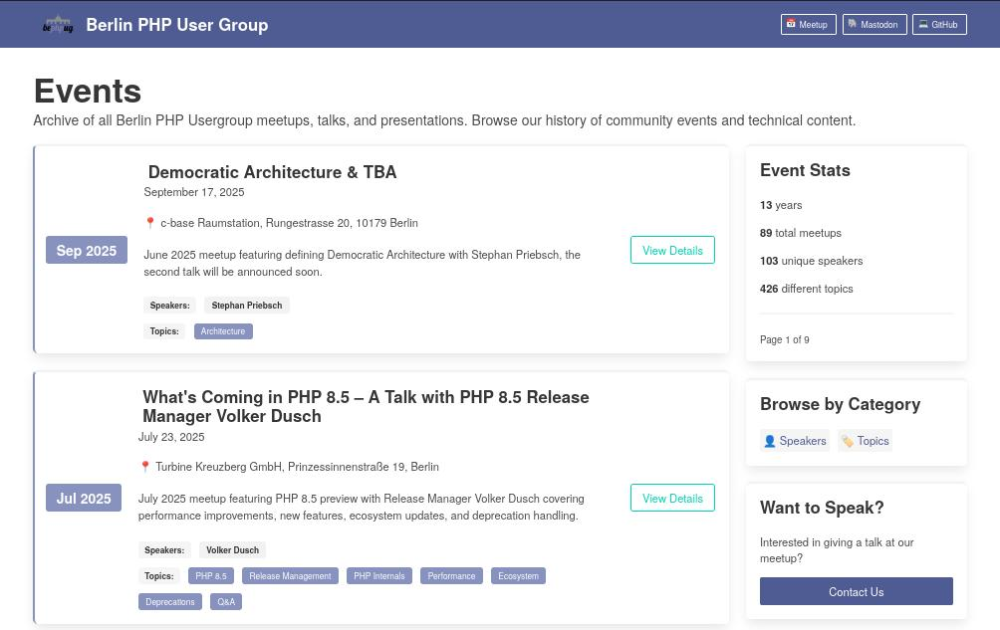
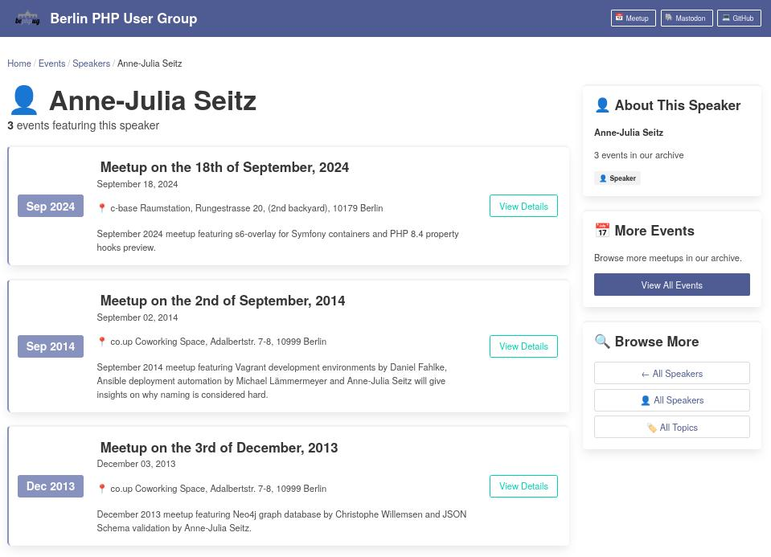

---  
title: "Summer Projects 2025: 3 websites in 3 weeks"
date: 2025-08-17T09:00:00+02:00
tags: [claude code, workflow, ai, zola, bulma, tailwindcss, css, c-base, bephpug]
image: hero.png
comments: true
toc: true
---

> "Three weeks, three websites — and yes, I actually took a proper holiday too."

During my summer vacation 2025, I had a bit of time each evening to hack away at my computer. Since I'd been wanting to tackle these projects for a while and felt motivated, I decided to take them on one after another. It wasn't originally planned as "one per week", but that's the rhythm that naturally emerged from the time I had available, the pace of development, and how long each project actually took. I'll get to what these projects were in a moment, but what I found more important was my goal to develop a solid workflow with **Claude Code**.

I've been exploring Claude Code for a few weeks now, and the topics you can research and discover with it are numerous.

## Claude Code Features


**Claude Code** is an **agentic coding tool** from Anthropic that runs directly in your terminal, allowing you to efficiently delegate programming tasks using natural language — without any extra chat windows or IDE integration.

Link: [https://docs.anthropic.com/en/docs/claude-code/](https://docs.anthropic.com/en/docs/claude-code/)



### Slash Commands `/commands`

Custom slash commands allow you to define frequently-used prompts as Markdown files that Claude Code can execute. Commands are organized by scope (project-specific or personal) and support namespacing through directory structures.
Link: [https://docs.anthropic.com/en/docs/claude-code/slash-commands](https://docs.anthropic.com/en/docs/claude-code/slash-commands)


The generate-command is my absolute favourite from my current collection, because it lets you create infinitely more and specialized commands.

`.claude/commands/generate-command.md`
````md
---
allowed-tools: Read, Write, Bash(mkdir:*), Bash(pwd)
description: Add a reusable slash command so anyone who clones your repo can invoke it with `/project:<name>` inside the Claude Code CLI.
---

## Context  
  
- Current directory: !`pwd`
- Current date: !`date +%Y-%m-%d`

## Usage

```
/generate-command Analyze content for SEO optimization opportunities across the blog
```
...

````

**Examples of commands for my technical blog**
- audit-reading-time.md  
- audit-seo.md  
- post-scaffold.md  
- posts-validate-content.md  
- team-add-member.md

Sometimes you don't even realize what you could automate, but when you work on a project for a while and start bundling work steps into commands, you notice more and more things that can be automated through commands.

### Subagents `/agents`

Subagents are preconfigured AI personalities that Claude Code can delegate tasks to. Each subagent operates in its own context, preventing contamination of the main conversation and keeping it focused on high-level goals.

Link: [https://docs.anthropic.com/en/docs/claude-code/sub-agents](https://docs.anthropic.com/en/docs/claude-code/sub-agents)


- Project level: `.claude/agents/`
- User level: `~/.claude/agents/`

````md
---
name: subagent-name
description: Description of when this subagent should be called
tools: tool1, tool2, tool3  # Optional
---
Your system prompt for the subagent...
````

When you have an idea for a subagent, you can have Claude generate one for you using `/agent`, which will then be stored in `.claude/agents/`.

### Background jobs `/bashes`
Claude Code can also run background jobs that aren't directly connected to the current conversation. This is practical for development with a static site generator, as you can have Claude monitor the build process logs and react directly when errors occur.


## Why Zola?

I wanted to create a technical blog. Previously my blog ran on Jekyll, now on Hugo, but I wanted to see what was currently popular before just defaulting to Hugo. The decision really came down to Hugo or Zola, but then I noticed that Zola uses Jinja2-like syntax for templates. I know Jinja2-style syntax from the Symfony world as Twig, and I can understand it easily — plus anyone who might want to extend the blog in the future (my colleagues also know Twig) can understand it too. That was an important decision criterion for me.

Static site generation means the website is generated upfront and then served as static HTML files. This has performance and security advantages since no database queries or server-side logic are needed. GitHub has been offering GitHub Pages for this for years, and it's incredibly simple to host a static website.


Zola is a static site generator (SSG), similar to Hugo, Pelican, and Jekyll. It is written in Rust and uses the Tera template engine, which is similar to Jinja2, Django templates, Liquid, and Twig.

Link: [https://www.getzola.org/](https://www.getzola.org/)



## Project 1: Technical Blog for OPEN Software Consulting


This page needs to be discussed with some decision makers before it gets deployed. Stay tuned.



Since there was no technical blog before, I could start completely fresh without any legacy concerns. I wasn't familiar with Zola yet and how it works, so I decided after a bit of research on the **DeepThought** theme, which I liked and also provided a good foundation for OPEN Software Consulting's corporate identity. 

I gave Claude the brand colors and that's how the current design of the site emerged. My workflow with Claude Code involved creating a `PLAN.md` file where I listed all the tasks I wanted to complete. I then kept updating this file and prompted Claude to take a task from the file, work on it, read the file (in case it had changed), check it off, commit, and then take the next task. This helped me keep track of everything and also document the work steps.


A simple blog theme focused on writing powered by Bulma and Zola

Link: [https://deepthought-theme.netlify.app/](https://deepthought-theme.netlify.app/)


### Reading Time
Something I hadn't thought of at all was reading time for blog posts. This is a feature Claude suggested and I really like it. Claude helped me calculate the reading time for each blog post and store it in the frontmatter. This was super practical because I could then display the reading time directly in the blog posts. There's now also a Claude Code command `/project:audit-reading-time` that calculates reading time for all blog posts and stores it in the frontmatter.

### Team/Authors
Since I created the site for OPEN Software Consulting, I also wanted to include team members as authors. For this, I created a `/project:team-add-member` command that allows me to add team members and create their profiles. This is super practical because I can easily manage team members and update their profiles. Under `/team/` you can find the team members and their profiles, which I created with Claude Code. Each author also has a list of their blog posts that they've written.

### Events
I also wanted to include the Symfony User Group events that we've been organizing for years. For this, I created a `/project:events-add-event` command that allows me to add events and manage their details. The events are displayed under `/events/` and are organized in the same structure as blog posts. This makes it easy to manage events and display them on the website.

### Taxonomies
I learned these are super important for structuring content. I created taxonomies for authors, categories, and tags to better organize the blog posts. Zola does a fantastic job making tags, categories, and authors easily browsable.

### Search
Zola has a built-in search function that I activated for the blog. This is super practical because readers can quickly find the content they're looking for. I also created a `/project:posts-validate-content` command that ensures all blog posts are correctly formatted and contain no errors.

### Additional Features
- **Cookie Banner**: Implemented to comply with privacy regulations.
- **Admonition Macro**: For special notices in blog posts.
- **Responsive Design**: The design is mobile-friendly and adapts to different screen sizes.
- **Hero Images**: Each blog post has a hero image defined in the frontmatter.
- **Taxonomy Pages**: Pages that display all blog posts and events by categories and tags.
- **SEO Optimization**: Blog posts are optimized for search engines to ensure better visibility.
- **Accessibility**: The website is designed to be accessible to all users.
- **Performance Optimization**: The website is fast and responsive since it's statically generated.
- **Deployment**: The website is automatically deployed to GitHub Pages when code changes are made.
- **Content Validation**: A command that ensures all content is correctly formatted and contains no errors.
- **Markdown Support**: All content is written in Markdown, making editing and maintenance easier.
- **Syntax Highlighting**: Code snippets in blog posts are automatically highlighted to improve readability (without line numbers).
- **Table of Contents (ToC)**: Automatically generated table of contents for blog posts that enable better navigation.

### Summary
I was amazed that I was done with the site after 5 days. And that's even though I only had a few hours each evening to work on it. I learned a lot about Zola and how taxonomies work. I also learned how easy it is with Claude Code to quickly get a simple project up and running. I hadn't known **Bulma CSS** before, but it's a lightweight CSS framework that works well with Zola and helped me quickly create an appealing design.


Bulma is a free, open source, modern, lightweight, CSS-only framework that provides ready-to-use frontend components, based on Flexbox for fast, responsive layouts with simple class names and no JavaScript.

Link: [https://bulma.io/](https://bulma.io/)


In four days, this project went from zero to:
- **67 commits** (averaging 16 commits per day)
- **2 blog posts** with comprehensive content
- **5 event pages** with real community data
- **1 team member profile** with avatar and expertise (mine)
- **Complete taxonomy system** for content organization
- **Advanced UI components** including admonitions and TOC

## Project 2: c-base Artefakt-Guide

The c-base artifact guide is a guide to the discovered artifacts of c-base for members of **c-base, the crashed space station under Berlin-Mitte**. The relaunch was necessary because the old website was outdated and no longer met requirements. The connection to c-base's LDAP system no longer worked and the PHP libraries were so outdated that they could no longer be updated. A website relaunch I had planned was **not completed twice**, so I decided to recreate the website with Zola.

What's missing now is the editing functionality for members, but I consider that a feature that can be added later. The website is now static and maintained by c-base members by updating the Markdown files in the repository. I did a bit of research - there are even UIs for sites stored in Git that allow content editing, but I decided not to set that up for now because it makes things technically more complex again and the project should first be relaunched in a simple version. One challenge is that the URLs must remain the same, since we have QR codes hanging on board that scan to the artifact guide for specific artifacts.

This time too, I created an initial document with Claude Code where I described in great detail what I wanted to do. The goal, current status, and desired end state. I already knew I wanted to use Zola, but for this project the layout was so specific that a ready-made theme would have mostly gotten in the way. After brief research, I decided on a custom theme. With **TailwindCSS and DaisyUI**, because both are on my list of things I want to gain experience with. This would later give me headaches and delay the project.

One requirement I set for every project is that they don't depend on any external sources in production. No CDNs for fonts, CSS, or JavaScript libraries. All resources are delivered statically with the site. But I still started with TailwindCSS delivered via CDN and postponed the problem of not finding a proper way to include it until later. 


Tailwind needs a JavaScript (npm) build step to parse existing CSS for used classes and save them in a CSS file. Either the JavaScript comes via CDN that parses my site at runtime (and tracks all users), or I install npm and the JavaScript libraries to parse locally.


For me, this mainly means that TailwindCSS becomes unusable, because:

1. My deploy process should be as simple as possible
2. npm is hell and I won't voluntarily let it into my house. It opens a dependency hell that becomes outdated and opens security vulnerabilities as soon as you don't update for 5 minutes.
3. End of story.

All the layout had to be recreated from scratch. Once that was clear, I gave Claude the task of migrating the existing layout to Bulma (which we already know). That took a few minutes until everything fit, and I had to help out quite a bit, and after running into the usage limit at least twice, the layout was sleek, I liked it, and it wasn't dependent on anything or anyone anymore.



This project contains a long list of features:

### Multilingual with c-lang 


c-lang is the constructed language of the c-base space station. The escalation system (0-3) provides increasing complexity from basic member communication to advanced c-lang usage.


Since c-lang isn't ISO standard, normal multilingual features can't handle it, and it took a while until I found an approach that wasn't cumbersome, didn't require writing markup in Markdown, or put all texts in the TOML configuration. Since most multilingual features change the URL per language, that wasn't an option, because the URL had to be fixed due to the QR codes pointing to them.

So now it's solved by having a separate file for each language and making the switch in the template. The main configuration is done in the default language, German and English only adjust the title.

### Taxonomy for `decc`, `location` and `ring`
Now you can browse the list of artifacts from the `oberdecc` or the `culture` ring. This also generates the next artifact that invites further browsing.

### Image Credits and Image Carousel
Image credits are preserved. The images were previously stored in a database and linked to artifacts with an n:m relation. Without a database, this now becomes denormalized into a 1:n relation: Each artifact has many images. The images are entered in the article's TOML config. The number of images determines whether a carousel is shown or just the image without control elements and pagination.


### Deployment
The project is packaged into a Docker image via GitHub Actions and pushed to GitHub's Container Registry tagged as latest. Then a webhook is called that ensures a script on a c-base server pulls 
the image and starts a container from it. Wasn't a problem at all, but something new to learn from GitHub.

### Summary
I would have liked to avoid the TailwindCSS route, but I'm glad I went through it because now I don't have to make the same journey in my project at work and already know that Bulma is the alternative.

Claude helped with:
- Creating the custom layout, twice
- The trilingual language switch without ready-made language features
- Content migration of existing artifacts and their images
- Scripts and commands to check:
    - Valid frontmatter
    - Valid taxonomies
    - All registered images are present and all existing images are registered
    - All links work
    - All translations are present
- Detailed documentation
- CI/CD with GitHub Actions

The project was super fun and quite a bit more time needs to be invested to claim the artifact guide is finished, because with this project, content is king. The site is a feast for the eyes and does justice to the space station. A good moment for a relaunch, because the space station turns 30 this year!


c-base celebrates its 30th orbit around the sun on Earth this year.


In 6 days, this project went from zero to:

- **64 commits** (averaging 10 commits per day)
- **92 c-base artifacts** with complete metadata and imagery
- **279 multilingual content files** across c-lang, German, and English
- **106 artifact images** co-located with content for optimal organization
- **3 complete language versions** with client-side switching for QR-code compatibility
- **7 comprehensive validation scripts** ensuring content quality and consistency
- **1,596 lines of custom Zola templates** built from scratch for authentic c-base styling
- **Complete taxonomy system** covering decc classification, station locations, and ring mapping
- **Full Docker deployment** pipeline with multi-stage builds and nginx configuration
- **Advanced search functionality** across all languages and artifact metadata
- **Production-ready static site** serving authentic c-base space station culture


## Project 3: Relaunch Berliner PHP Usergroup Website

The Berlin PHP User Group site was created in 2011, before that it was a wiki (?). **Jekyll** was used, which was state-of-the-art at the time. The site has, as mentioned, gotten long in the tooth and I had no desire to maintain an old site after taking over the organization of the Berlin PHP Usergroup.


Jekyll is a static site generator. It takes text written in your favorite markup language and uses layouts to create a static website. It's written in Ruby and was one of the first SSGs that you could use with GitHub Pages.

Link: https://jekyllrb.com/


I analyzed the content of the old site and found that it would be better to represent the ""Archive" as the list of events, which is what the usergroup is all about, since a Markdown page was diligently created each time. Many events also include slides and source files that speakers had uploaded. I wasn't sure at first whether we should keep them, but after seeing that it was under 100MB, the question was off the table and the answer was a clear "Yes!"

Together with Claude, I created a spec until everything I envisioned was correctly listed:
1. Zola SSG with custom theme using Bulma CSS
2. PHP colors
3. Landing page
4. List of all events
5. Taxonomy for speakers and topics

I first imported one event, checked that everything fit, then we imported 5 more events from the old repository and more adjustments had to be made. Then I had to take a break for the day because 
I hit Claude's token limit. After that I just had Claude to its thing importing all events and deciding on the topics for each event. I would never have tried to do this if it wasn't for a helping 
hand from AI.


### Events
Thanks to the simple structure, you can now easily view all past events and browse the topics and speakers for each event.



### Speaker
Each speaker has their own page listing all events where they gave a presentation.


### List of All Speakers
In the overview of all speakers, speakers are sorted so that those with the most talks are listed at the top.


### Summary
I'm excited that with the new site there's now a way to browse the long history of the Berlin PHP Usergroup. I thought it was cool to see the numbers:


- ~13 years
- 98 meetups
- 103 speakers

Link: https://bephpug.de/



That really motivates me!

The project evolved from initial setup to a fully functional community website with automated deployment in just 4 days

- **14 commits** across 4 development days
- **Complete** static site generator migration from Jekyll to Zola
- **Complete website redesign** with Bulma CSS
- **Events system** with modern styling and navigation
- **SEO-friendly URL structure** for all events
- **Historical event archive** with 98 migrated events
- **Modern taxonomy system** for speakers and topics
- **Production deployment** pipeline with GitHub Actions


## What I Learned from all 3 projects

**Why "staying out of the way" is an underestimated feature:**
Zola's simplicity meant I spent time solving actual problems rather than fighting the tool. When technology doesn't create friction, you can focus on what matters - the content and user experience.

**Bare minimum first:**
There are a ton of features that can be added, but they all make the project more complex and introduce possible bugs. Keeping it simple and doing only the bare minimum to have the project 
shippable was a fun achievement.

**How different projects help you really understand a tool:**
Each project pushed different boundaries: 
- Project 1 taught me Zola basics and taxonomies
- Project 2 forced me into custom themes and multilingual complexity
- Project 3 showed me content migration and community site patterns

**Tips for other developers wanting to start with Zola:**
- Start with an existing theme for your first project to understand the patterns
- Embrace the simplicity - don't over-engineer from the start
- Use taxonomies liberally - they're powerful for content organization
- Co-locate assets with content when possible
- The template system is intuitive if you know Jinja2/Twig

## Summary & Outlook

**Quick retrospective: 3 websites – check.**

**Key insight: A good tool is one that allows you to implement your ideas quickly.**

Three weeks of evening development resulted in three production (ready) websites, each serving real communities and solving actual problems. The combination of Claude Code's intelligent assistance with Zola's straightforward architecture created a development experience that felt more like guided conversation than traditional programming.

The pattern that emerged wasn't planned but proved effective: detailed planning documents, iterative development with AI assistance, and focus on shipping functional solutions over perfect implementations. Sometimes the best workflow is the one that naturally evolves from the constraints you're working within.
