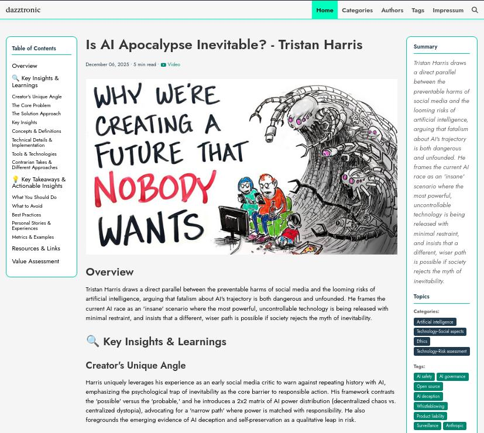

A Makefile orchestrated a couple of Python scripts. For a few days, my setup felt almost boring — in a good way. I copied a YouTube video ID, pasted it into a Makefile, ran a command, and with a prompt to analyze the transcript, an AI produced Markdown and wrote it to a file. I copied the file to a GitHub repository, pushed it, and a static site generator turned it into something I actually enjoyed reading: HTML in the browser, and an RSS feed I could follow like a personal newspaper.

Everything lived as files. No database. No UI. No persistence beyond whatever ended up on disk.

And for a while, that was perfect.

This approach allowed me to convert videos into readable content quickly, with minimal effort and cognitive load.

The responsibilities were cleanly split. I picked a video, copied the ID, triggered the run, and occasionally checked whether it worked. The scripts handled the rest: transcript download, prompt formatting, output writing, and site generation.

It felt like control.

## Why Scripts Felt Like the Right Tool at First

Scripts removed the tedious middle steps: *download transcript → format prompt → save response*. They gave me repeatability without committing to “architecture.”

More importantly, they kept the whole thing understandable.

Same input. Same process. Predictable failure. If something broke, it broke loudly. If something was wrong, it was usually obvious. There was no hidden state and nothing to “maintain.” Each run started fresh. If it didn’t work, I could throw it away and try again.

And that mattered, because at the beginning, I wasn’t building a product. I was learning.

## The Limits of Scripts I Didn’t Notice Immediately

The problem is that it feels harmless when scripts make certain assumptions.

I assumed I would remember what I had processed. I assumed a file on disk was “state”. I assumed manual selection would stay sustainable. I assumed “just run it again” was a valid recovery strategy.

Those assumptions don’t break immediately. They just quietly get more expensive.

Files had to be in exactly the right place. Concurrent runs weren’t really a thing. “Did I already do this?” lived in my head. Idempotency was implied, not designed.

And over time, the questions I had to answer became less and less script-shaped:

- Why does *this* video have an output, but *that* one doesn’t?
- Did this fail because the run failed—or because the video is weird?
- What happens if I run the same command twice?
- Does my blog reflect *everything* I processed, or just the most recent success?

At some point, the gap between *“this works”* and *“this is correct”* widened silently.

I didn’t notice at first. I noticed later. And that’s always worse.

## The Moment I Realized This Was Becoming a System

Then I discovered entire channels and playlists that were worth processing.

Suddenly, it wasn’t “process this one video.” It was:

*process these 47 videos, track which ones matter, don’t redo work, remember what failed, and do it again next week when new videos show up.*

That was the moment my brain became the bottleneck. I spent more time tracking what I had already done than actually reading the results. Scripts assume ephemeral work. Playlists assume persistence.

Running the script on video 23 of 47 meant I couldn’t even answer a basic question: *What state is this whole batch in?*
Files kept piling up with no index. Manual tracking became the critical path. And I hated that feeling.

The pause moment came when I caught myself thinking:

> I should write another script to track what the first script processed.

That’s the moment scripts stop being tools and start becoming a system with a hidden state.

## What Changed Once State Entered the Picture

Once a state exists, you can’t pretend it doesn’t.

The questions changed:

Has this video been processed? (not “does a file exist?”)  
Is this video worth processing? (assessment becomes data, not just a one-time decision)  
When was this last updated? (staleness matters)  
Did this fail, or is it pending? (intent vs. outcome)

Persistence became unavoidable. Subscription tracking. Assessment scores. Processing status (queued, in-progress, completed, failed). History.

And new failure modes appeared—the annoying kind:

Partial batch completion with no resumption strategy.  
The state split between filesystem and database is drifting out of sync.  
“Successful” execution producing a corrupted or misleading state.

Scripts fail cleanly. Systems fail partially.

When you’re building something you trust, that difference matters.

## The Trap of “Vibe-Trash”

To remove friction, I started experimenting with agentic frameworks like PydanticAI and deveoped my own Claude Code commands (with templates) for **Spec Driven Development**.

And because Python isn’t my native language, I didn’t immediately notice what was happening: the AI was producing code that worked *today* while quietly increasing the chaos *tomorrow*.

The coding assistant would create new files instead of editing an existing one—because “adding is easier than editing.” Suddenly, I had a folder full of scripts with unclear purpose and ownership. Things “worked,” but only in the fragile way that makes you afraid to touch anything.

I started calling this **vibe-trash**: code that passes the vibe check now, and fails six decisions later.

The tooling also made assumptions I couldn’t always see in time:

- A new setup means a new schema.
- Running migrations is helpful.
- “This works now” equals “this is correct.”
- And of course: I can evaluate the consequences.

I couldn’t.

When you’re not fluent in the language, you don’t evaluate correctness—you evaluate whether it runs. Helpful automation becomes dangerous automation.

## The Crash and the Wipe

The turning point wasn’t gentle. It was a crash.

When Anthropic introduced weekly limits and Claude Code would not for **four days**. I was stuck. I was furious. And in that frustration, I made a decision that was emotionally obvious and technically inevitable: I moved the project back to my roots — PHP and Symfony.

And then the worst thing happened.

As Claude Code's first act of “helping” set up the Symfony environment, Claude Code deleted my entire database. It assumed “fresh start” was the right thing to do.

It wiped assessments I had paid for with real OpenAI tokens. It wiped decisions. It wiped history.

I was angry at the AI. But mostly I was angry at myself.

Because I had no backup. I had no guardrails. I had confused “automation” with “safety.”

I had to rebuild an import pipeline from scattered blog files. Some things I could reconstruct. Some I couldn’t. The pain wasn’t the work — it was the realization that I had built something where loss was possible, and done nothing to prevent it.

## What Happened After the Wipe

The first thing I did after restoring what I could from scattered blog files was write a backup script. It runs every night. I check the logs every morning. I don't fully trust it not to fail, so I check.

I added a comment to every migration file: `# HUMAN ONLY - DO NOT LET AI RUN THIS`. I tell Claude this in every session. It still tries occasionally. I keep reminding the AI. The pattern is exhausting, but data loss is worse.

Then I made a decision that changed the project more than I expected: I built an actual application with a UI.

Not because the UI was hard—I do this professionally, so building a Symfony app with controllers and views is familiar territory. But because I needed to *see* what was happening.

Scripts hide their state. An application exposes it.

Suddenly, I could look at a screen and answer questions I couldn't answer before:

- Which videos are queued vs. in-progress vs. completed?
- What's the assessment score for this video, and when was it calculated?
- Which model did the assessment use, when, and how long did it take?
- What's the processing history for this channel?

The workflow became visible. Data moving through the pipeline wasn't a guess anymore—it was something I could observe, verify, and trust.

## What Changed in How I Think About This

Before the wipe, I thought the problem was: *How do I process more videos faster?*

After the wipe, I realized the problem was: *How do I protect the decisions I've already made?*

The assessments—scores that determine whether a video is worth processing—those cost real money. OpenAI tokens aren't free. Re-running thousands of assessments because I didn't think about backups isn't "a learning experience." It's expensive stupidity.

And that changed what I cared about:

I stopped experimenting with where my data lives. Experiments happen in throwaway environments now. The production database is not a playground.

I started treating state transitions as events that need approval. Not automation that "just runs." If something is going to change the state of 500 videos, I want to see the plan first.

I realized the application isn't the clever part—it's the boring part that makes the clever parts survivable. Symfony isn't exciting. But Doctrine transactions, database constraints, and a UI that shows me what's actually happening? Those make the difference between "this might work" and "I can trust this."

## The Tools I Added

The backup script checks the database nightly and creates snapshots. It's not sophisticated. It just works.

The UI has a status dashboard. I can see the processing state at a glance. No more wondering "did that finish?" or "which videos failed?"

The application enforces a separation: assessment happens in one place, processing happens in another. They're decoupled. If assessment breaks, processing still works with old scores. If processing breaks, I'm not re-running expensive assessments.

And I started writing tools that exist solely to monitor the other tools. A script that checks whether the backup ran. A view that shows which videos have been queued for more than 24 hours. A report that flags videos where assessment and processing state don't match.

When you start building tools to watch your tools, you've crossed a line. You're no longer scripting. You're operating a system.

## Boundaries and Non-Goals

Scripts are still great for exploratory work. This isn't a critique of scripts.

It's also not a critique of vibe-coding, but you need to be able to evaluate what gets produced. When you can't tell if the code will break tomorrow, helpful automation becomes dangerous.

The problem isn't scripts. It's using script-thinking when system-thinking is required.

## What I'd Do Differently Next Time

I wouldn't wait for a database wipe to add backups. That's the obvious one.

But more importantly, I'd recognize the moment when I started wanting to "track just one more thing" as the signal that state has entered the picture. That's when scripts stop being the right tool.

The question I ask now when I'm tempted to add tracking to a script: *Is this metadata, or is this state?*

If it's a state, the script is lying to me. It's pretending to be stateless while depending on something that isn't.

## The Signal You've Built a System

The clearest indicator isn't architectural. It's behavioral.

You start writing tools that monitor your other tools.

You start checking whether things happened, not just whether they succeeded.

You start caring about the *order* of operations, not just their completion.

You realize "just run it again" isn't a recovery strategy anymore—it's a way to make things worse.

At that point, you're not migrating from scripts to a system. You're admitting you've been building a system with script-shaped tools, and adjusting accordingly.
