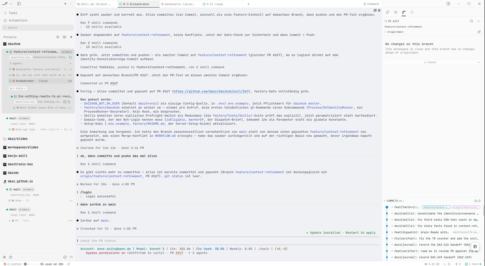

I used to open an IDE, open a terminal, find the right file, make a change, and run the tests myself.

That is still a perfectly reasonable way to develop software. It is also no longer the way I want to work.

At the beginning of August, I moved my development into [Herdr](https://herdr.dev/). Herdr gave me the first important step away from an IDE: one terminal interface for several agents and projects. I could send an agent to work, switch to another project instead of watching it, and see when the first agent had finished.

That already matched the way I wanted to work. An IDE assumes that I operate Git, the file browser, the terminal, and the editor. Once a coding agent operates those tools, my job moves up a level. I describe the work, give the agent the project context, inspect the result, and decide what happens next.

Herdr brought the pieces together for me. I did not use it for long, because I found [Orca](https://onorca.dev/) soon afterwards and was stunned by how much more it brought around the same agent-management idea.

## From Herdr to Orca

I had already stopped waiting beside a single coding agent. Herdr let me manage several agents and projects from one place. Orca kept that model and added workspaces, using git worktrees, orchestration, skills, automation, remote clients, and even a server runtime.

I installed Orca on my computer first. During installation and setup it changed enough on my system that I reconsidered where any of my AI development should run. Coding agents install tools, create worktrees, start containers, store credentials, and leave session data behind. I no longer wanted all of that mixed into my personal workstation. Additionally, I wanted to give my agents as much freedom as possible to no longer being blocked by asking me or any other model for permission to access or execute.



Orca's documentation described several [remote-server setups](https://www.onorca.dev/docs/remote-servers). I could have rented a virtual server. Instead, I already had a powerful AI computer sitting on my desk, so I created an Ubuntu VM on it and moved Orca, the agents, the repositories, and Docker into that VM.

That decision made Orca much more than the richer successor to the setup I had in herdr. The agents now had a permanent place to work, independent of the computer I happened to be using.

## What Orca adds to coding agents

Orca does not replace GitHub, Git, Docker, Claude Code, or Pi. It puts them into an environment where several agent sessions can work at once and where I can manage them as work rather than as disconnected command lines.

The parts I use most are these:

- workspaces and Git worktrees for isolated tasks;
- terminals that belong to those workspaces;
- several agents and models in one runtime;
- orchestration, where a coordinator can start worker sessions and aks them to communicate with each other;
- skills and project context that tell an agent how this repository works;
- remote access from a desktop or phone via Tailscale VPN;
- a headless server mode that keeps the work alive when my computer is closed;
- automations that can run recurring, narrowly scoped actions;
- session history and runtime state that make it possible to inspect what happened.

The important feature is not any one item in that list. It is that Orca treats agent work as something that has a lifecycle.

## Worktrees are not a detail

DazzHub is the project where I am testing this way of working. It is a Symfony application that discovers YouTube videos, scores them with AI, fetches transcripts, and turns them into searchable knowledge and Markdown blog posts. It has PostgreSQL with pgvector, Neo4j, asynchronous workers, external services, and a serious test and architecture toolchain.

It is also exactly the kind of existing project where two agents must not casually share a checkout.

For an issue, I create an Orca worktree. The issue gets its own branch, directory, terminal, and agent session. The agent can inspect the project, edit files, run the checks, commit, push, and open a pull request without writing into the checkout where another task is running.

The isolation is more important than the interface. Two agents editing the same working tree can make both sessions appear productive while producing a diff nobody can explain. A separate worktree turns that into two inspectable pieces of work.

In practice, my flow looks roughly like this:

```bash
orca worktree create --name "152-embedding-agent-to-domain-service" \
  --repo path:/srv/workspaces/dazzhub \
  --base-branch main --issue 152 --activate --json

orca terminal create --worktree "path:$WORKTREE" \
  --title "pi gpt-5.6-sol DAZ-152" \
  --command "pi --skill $WORKTREE/.claude/skills --model gpt-5.6-sol" \
  --json
```

The exact commands are wrapped by DazzHub's factory tooling now, but the shape matters: create an isolated place first, then start the worker inside it.

## I do not use one agent for everything

Claude Code is still part of my daily work. Pi runs alongside it and is especially useful when I want a different agent implementation, model, or an independent review.

They share a machine, but they do not share identical behavior.

Claude Code and Pi have different session formats, startup behavior, and ways of loading project context.

The agents run as the server user, with the permissions of that user. Pi has no permission system that makes an unattended run safe by itself. The containment is provided by the machine: the runner has no sudo, Docker is rootless, and the repositories and credentials belong to that runner. This is an operational boundary, not a magic property of the model.

## The repository is part of the agent

The biggest mistake would be to think that Orca makes prompts unnecessary. It makes the surrounding system more important.

DazzHub has an `AGENTS.md`, project rules, architecture documentation, workflow documentation, skills, tests, Make targets, and a small factory CLI. Those files explain how the project is supposed to be changed. The agent is not just given an issue; it is given the local way of working.

I use focused skills for individual roles instead of one giant super-prompt. They do not replace deterministic checks. They tell the agent what to do. The factory CLI and CI enforce the parts that should not depend on the model remembering them.

That distinction has become central to my system: a prompt may propose a transition, but it must not be the authority that silently performs every transition.

## How I give the system work

My source of work is the GitHub Project board. The board has states such as `Backlog`, `Ready`, `In progress`, `Blocked`, `In review`, and `Done`. The workflow document defines which actor may move a card and which transitions are forbidden.

I do not throw a pile of vague ideas at an agent and hope that it turns them into good work. I refine the issue until it has a clear scope, acceptance criteria, and enough information for an implementer to start without inventing the product decision.

The current factory separates intake from execution.

The backlog groomer reads the board and the code, then performs at most one useful action: promote one fully specified card to `Ready`, ask one question that blocks it, or report that there is nothing it can responsibly promote. It does not write code.

The board walker reads `Ready`, claims an eligible card, creates its worktree, starts the implementer, and records the dispatch only after the terminal is actually running. It does not merge, review, or follow the worker. That is deliberate. Small permissions are easier to reason about than a general-purpose autonomous manager.

A precheck keeps a full queue from starting another model session. A skipped automation run is normal. It means there was no work the actor was allowed to take, so no session and no tokens were spent.

The implementer then follows the DazzHub path:

1. claim one issue;
2. inspect the repository and the acceptance criteria;
3. change only the requested scope;
4. run CS Fixer, Deptrac, PHPUnit, and PHPStan through the project gate;
5. correct failures or stop with a precise blocked reason;
6. push the branch and open a pull request;
7. wait for review and approval before merging.

I do not want an agent to merge merely because the tests are green. CI tells me that the tested constraints pass. It does not make the product decision for me.

## Orca lets me orchestrate instead of babysit

There are two ways I use multiple sessions.

Sometimes I start several independent issue workers. Each one has its own worktree and its own terminal. That is the simple form of parallelism: several pieces of work move at the same time, and I can inspect each result separately.

The other form is a coordinator session. A coordinator receives the larger task, breaks it into bounded work, and starts worker sessions in child worktrees. The coordinator can keep the overall plan while each worker gets a narrower context.

This is where Orca feels very different from a normal IDE. An IDE can open five terminals. Orca gives me a place for a group of agents whose relationships are part of the runtime.

It also makes the limits visible. Parallelism is not automatically good. Agents can still collide conceptually, use the same external resources, exhaust API limits, or create more review work than I can handle. Worktree isolation prevents one class of damage; it does not remove the need for a queue, a WIP cap, or human judgment.

## Building the remote Orca server

I set up an Ubuntu VM called `dazztronic-box` and installed Orca there. Ubuntu gives Orca and the tools installed by agents a conventional Linux environment.

The VM runs on the AI computer already sitting on my desk and connects to my devices through Tailscale. I did not need to rent another server or expose Orca directly to the internet.

I separated the operator account from the account that runs Orca and the agents. The runner has no sudo access and uses rootless Docker. With that boundary in place, all AI development can happen inside the VM instead of altering my workstation.

## Headless Orca and remote access

`orca serve` keeps the runtime on the VM. I connect from the desktop client or the Android app through Tailscale, while the repositories, sessions, containers, and running agents remain on the server.

This changed my daily life most. I can start an agent at home, close the computer, and later reconnect from my phone to inspect its state, answer a question, or send another instruction.

I also enabled Orca's voice feature and let projects share a workspace. An agent working on DazzHub can move to the blog repository and draft an article from the work it just inspected. For persistence, Orca runs as a systemd service and returns after a reboot without depending on my desktop.

## Observability matters once agents multiply

With several agents on a server, I also want one place to see what happened across their different session formats. I am adding a self-hosted Langfuse instance to collect traces from Claude Code and Pi without replacing those runtimes.

Those traces may contain prompts, tool calls, paths, and secrets, so I treat the observer as sensitive infrastructure rather than a harmless dashboard.

## What I still do myself

I am not pretending that Orca has removed me from software development.

I define what matters. I refine vague issues. I decide which work is safe to run in parallel. I inspect the plan and the diff. I read the failures that the agents cannot resolve. I review pull requests and approve merges. I decide when a blocked card is ready to try again.

The difference is that I no longer have to spend my attention on every keystroke or sit beside every running process. The system can carry work while I am away, and it leaves me places to inspect the result.

There are still important boundaries. Not every automation is fully proven end to end. Central logging has to be checked against real traces, not merely a successful hook installation. Resource limits, API limits, review capacity, and overlapping work remain real constraints. An unattended agent can still do the wrong thing quickly.

That is why I keep the factory's permissions narrow, isolate worktrees, run deterministic gates, record blocked states, and retain a human merge decision.

## I do not want to go back

The thing I love about [onorca.dev](https://onorca.dev/) is not that it makes an agent type faster. It changes what is possible to supervise.

I can give work to several agents. I can see where they are. I can let them use different models and tools. I can keep their work isolated. I can leave the computer. I can reconnect from my phone. I can add a coordinator, a board, a queue, scheduled actors, tests, and traces around the sessions.

The IDE was designed for me to operate the tools. Orca is designed for me to build a system in which agents operate the tools and I operate the system.

That is a long way from normal software development. It is also the first development workflow I have used where I genuinely do not want to do anything else anymore.

The next boundary is the uncomfortable one: deciding how much of the final review and merge process can become machine-governed without turning a green check into an excuse to stop thinking.
